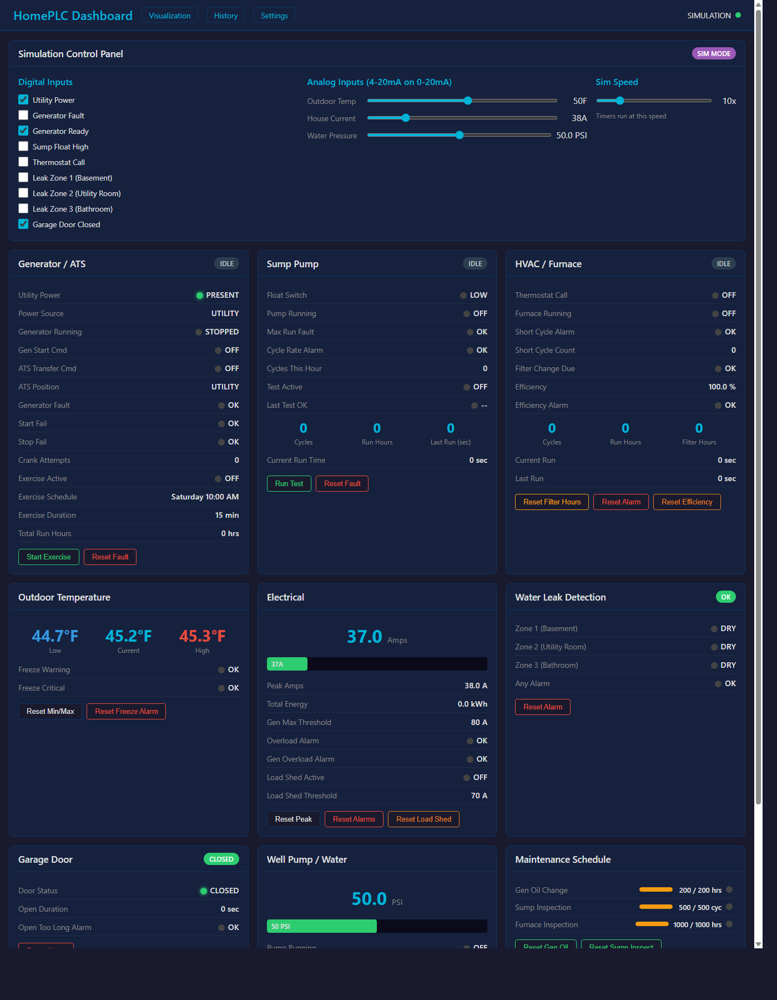
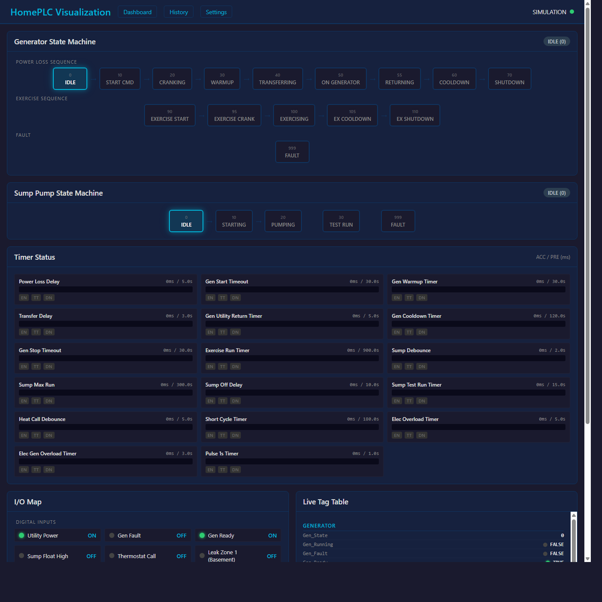
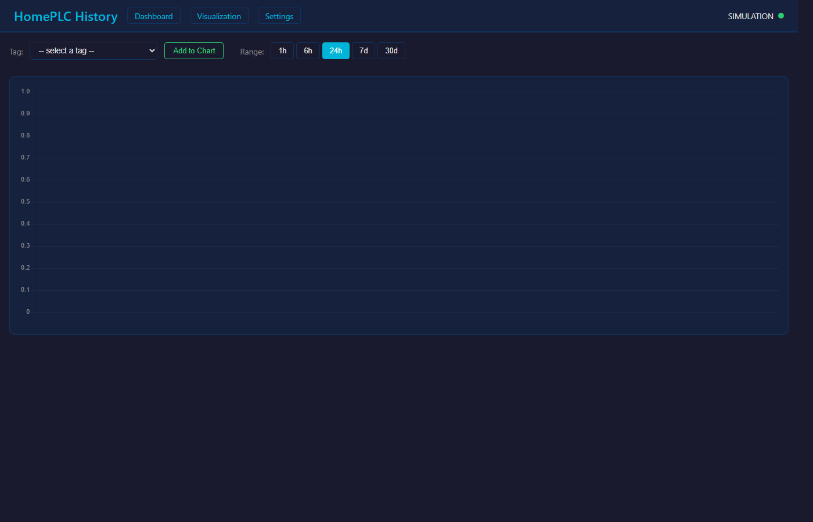
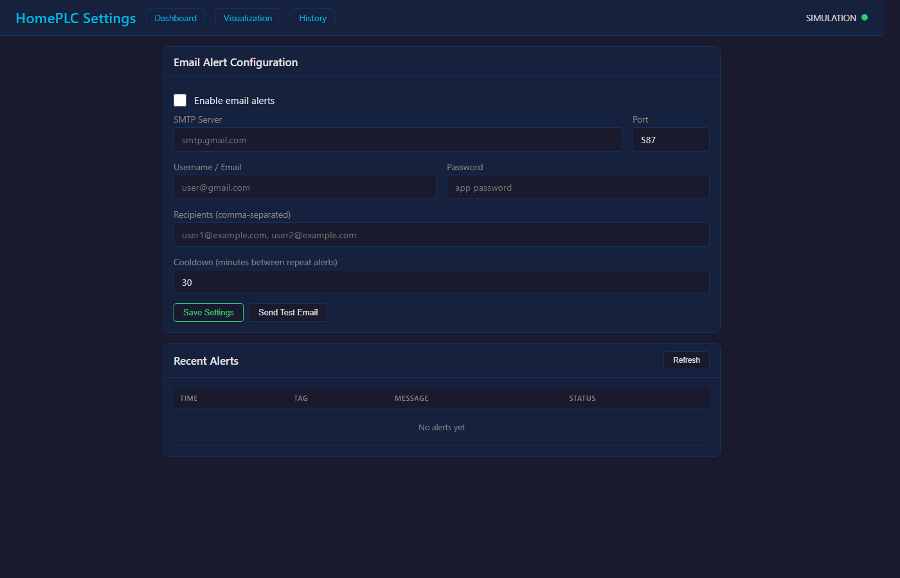

# HomePLC HMI

A complete home utility monitoring and control system built on an Allen-Bradley CompactLogix PLC with a web-based HMI. Monitors generator/ATS, sump pump, HVAC, electrical, water pressure, leak detection, and garage door — all from a browser on any device.

Built by a controls engineer using Studio 5000 ladder logic, Python, and Flask.

## Screenshots

### Dashboard


### PLC Logic Visualization


### Historical Trends


### Alert Configuration


## System Overview

This project replaces a wall of indicator lights and a clipboard with a single web page. The PLC handles all the real-time control logic — the HMI just reads tags over EtherNet/IP and displays them. No cloud, no subscriptions, no internet required. Everything runs on your local network.

### Generator / ATS Control
Automatic standby generator management with a full state machine:
- **Power loss detection** with configurable delay to ride through short outages
- **Auto-start sequence** — crank attempts with timeout and fail detection
- **Warmup timer** before transferring load via the ATS
- **Auto-transfer** to generator power, return to utility when power is restored
- **Cooldown cycle** before shutdown to protect the engine
- **Weekly exercise scheduler** — configurable day, time, and duration so the generator runs itself on schedule
- **Start/stop fail alarms** with HMI reset
- **Total run hours** tracking

### Sump Pump Monitoring
Keeps your basement dry and tells you when something's wrong:
- **Float switch monitoring** with debounce to filter noise
- **Pump run tracking** — cycle count, total run hours, last run duration, current run timer
- **Max run fault** — alarms if the pump runs too long (stuck float or failed check valve)
- **Cycle rate alarm** — flags when the pump kicks on more than 10 times per hour, which usually means a failing check valve or rising water table
- **Manual test mode** — run the pump on demand from the HMI to verify operation
- **Maintenance reminder** at 500 cycles

### HVAC / Furnace Monitoring
Tracks your heating system and catches problems before they get expensive:
- **Furnace run detection** from the thermostat W wire
- **Cycle counting and run hours** — know exactly how hard your system is working
- **Short cycle detection** — alarms when the furnace is cycling on/off too quickly, which can indicate a flame sensor issue, clogged filter, or oversized equipment
- **Filter run hours** with change reminder so you never forget
- **Efficiency tracking** — compares furnace runtime against heating degree-days. If the house needs more runtime for the same outdoor temperature, something is degrading (dirty filter, duct leak, insulation problem)

### Outdoor Temperature
Simple but useful:
- **Live temperature** from a 4-20mA sensor scaled through the analog input module
- **Daily min/max tracking** with manual reset
- **Freeze warning** at 35°F — heads up to take precautions
- **Freeze critical alarm** at 20°F — pipe freeze territory, act now

### Whole-House Electrical
Current transformer on the main feed gives you visibility into your power usage:
- **Live amperage** with a visual power bar
- **Peak amps tracking** with reset
- **Estimated kWh** accumulation
- **Overload alarm** — catches sustained high current draw
- **Generator overload alarm** — separate threshold for when running on generator power
- **Automatic load shedding** — when on generator and amps exceed the threshold for 10 seconds, relay outputs drop non-critical loads (HVAC, etc.) to protect the generator

### Water Leak Detection
Three moisture sensor zones with immediate alarming:
- **Zone-based monitoring** — basement, utility room, bathroom (or wherever you place sensors)
- **Latching alarms** — a leak alarm stays active until you manually acknowledge it, even if the sensor dries out. You don't want to miss a leak
- **Any-zone alarm** for the banner and email alerts

### Garage Door Monitor
Simple mag switch tells you what you need to know:
- **Open/closed status** with duration tracking
- **Open too long alarm** — configurable threshold (default 30 minutes)
- Door status visible from the dashboard without getting up to check

### Well Pump / Water Pressure
For homes on well water:
- **Live water pressure** from a 4-20mA pressure transducer (0-100 PSI)
- **Pump cycle tracking** — count and run duration
- **Short cycle detection** — if the pump runs less than 30 seconds and cycles repeatedly, the bladder tank is likely waterlogged
- **Low pressure alarm** — catches pump failure or supply issues

### Maintenance Schedules
Run-hour and cycle-based reminders so nothing gets missed:
- **Generator oil change** — due at 200 run hours
- **Sump pump inspection** — due at 500 cycles
- **Furnace inspection** — due at 1000 run hours
- Each has a progress bar showing hours/cycles remaining and a reset button after service

### Historical Data Logging
SQLite database logs 24 key tags every 60 seconds:
- **Trend charts** with Chart.js — select any logged tag and view 1 hour to 30 days of history
- **Multi-tag overlay** — compare outdoor temp vs furnace runtime, or current draw vs generator state
- **Auto-purge** — keeps 90 days of data, cleans up automatically
- Accessible at `/history`

### Email / SMS Alerts
Get notified when something needs attention:
- **20 alarm types** monitored — generator faults, sump failures, leaks, freeze warnings, overloads, maintenance due
- **SMTP email** with TLS — works with Gmail, Outlook, or any SMTP provider
- **SMS via email-to-text** gateways (e.g., `5551234567@vtext.com` for Verizon)
- **Cooldown timer** — won't spam you with the same alarm (default 30 minutes between repeats)
- **Test button** to verify your email config works
- Configure at `/settings`

## Hardware

| Slot | Module | Purpose |
|------|--------|---------|
| 0 | 5069-L306ERM | CompactLogix controller |
| 1 | 5069-IB16 | 16-point digital input (13 used) |
| 2 | 5069-OB16 | 16-point digital output (6 used) |
| 3 | 5069-IF8 | 8-channel analog input (3 used) |

### I/O Allocation

**Digital Inputs (Slot 1):**
| Point | Signal |
|-------|--------|
| Pt00 | Utility power present |
| Pt01 | Generator running feedback |
| Pt02 | Generator fault |
| Pt03 | Generator ready |
| Pt04 | ATS utility position |
| Pt05 | ATS generator position |
| Pt06 | Sump pump float switch |
| Pt07 | Thermostat W (heat call) |
| Pt08 | Leak sensor zone 1 |
| Pt09 | Leak sensor zone 2 |
| Pt10 | Leak sensor zone 3 |
| Pt11 | Garage door mag switch |
| Pt12 | Well pump running |

**Digital Outputs (Slot 2):**
| Point | Signal |
|-------|--------|
| Pt00 | Generator start command |
| Pt01 | ATS transfer command |
| Pt02 | Sump pump run |
| Pt03 | Load shed - HVAC |
| Pt04 | Load shed - non-critical 1 |
| Pt05 | Load shed - non-critical 2 |

**Analog Inputs (Slot 3):**
| Channel | Signal | Range |
|---------|--------|-------|
| Ch00 | Outdoor temperature | 4-20mA on 0-20mA (-40 to 120°F) |
| Ch01 | House current (CT) | 4-20mA on 0-20mA (0-200A) |
| Ch02 | Water pressure | 4-20mA on 0-20mA (0-100 PSI) |

## PLC Program

The Studio 5000 L5X project is in `studio5000/`. It contains:
- **210 tags** (BOOL, DINT, REAL, TIMER)
- **12 routines** — MainRoutine + 11 subroutines
- `build_l5x.py` regenerates the L5X if you need to modify the ladder logic

Import `HomePLC.L5X` into Studio 5000 Logix Designer v30+.

## Running

**Simulation mode** (no PLC required):
```
python app.py --sim
```
Or double-click `run_sim.bat`. The built-in simulator replicates all PLC logic in Python with adjustable timer speed (1x-50x).

**Live mode** (connected to PLC):
```
python app.py
```
Edit `PLC_IP` in `app.py` to match your controller's IP address.

**Pages:**
| URL | Description |
|-----|-------------|
| `/` | Main dashboard |
| `/viz` | PLC logic visualization (state machines, timers, I/O) |
| `/history` | Historical trend charts |
| `/settings` | Email alert configuration |

## Requirements
- Python 3
- Flask (`pip install flask`)
- pylogix (`pip install pylogix`) — only needed for live mode

## Deployment

See [DEPLOY_PI.md](DEPLOY_PI.md) for step-by-step Raspberry Pi setup instructions, including auto-start on boot.
